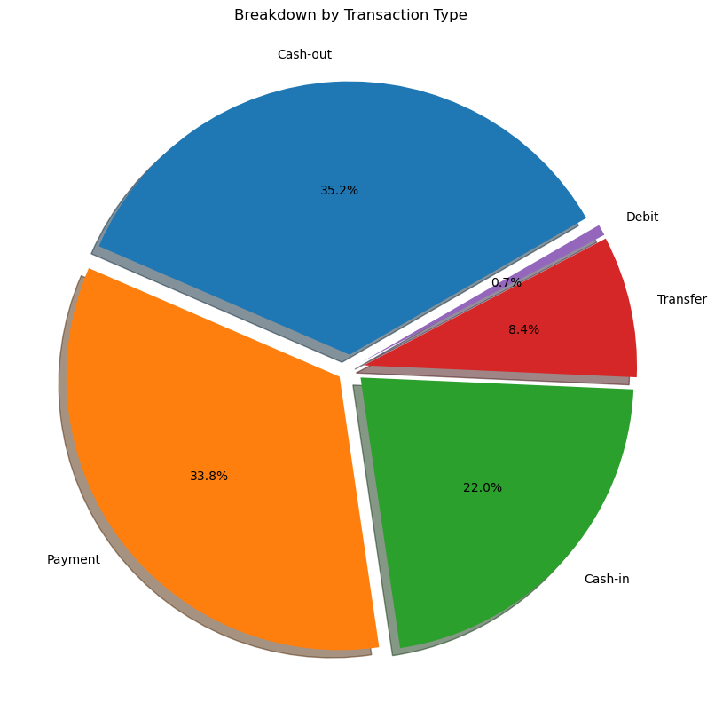
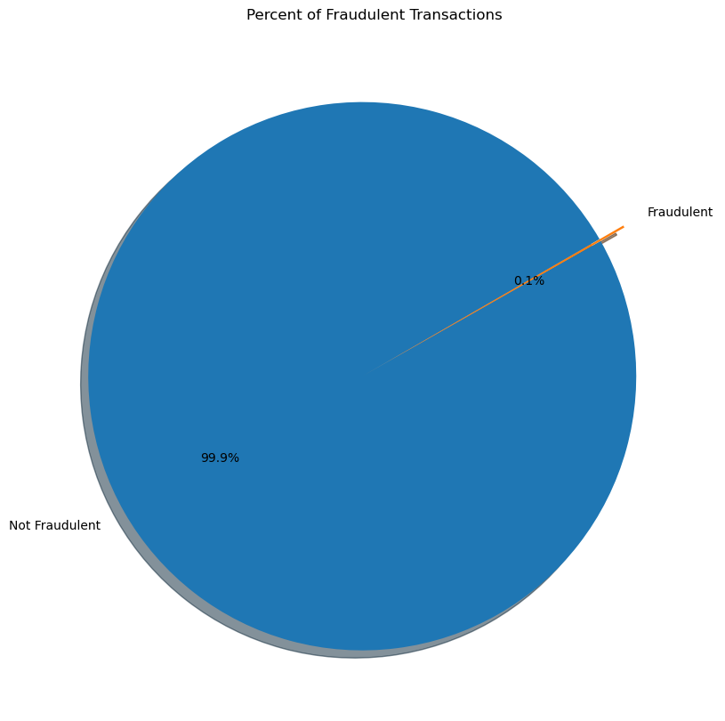
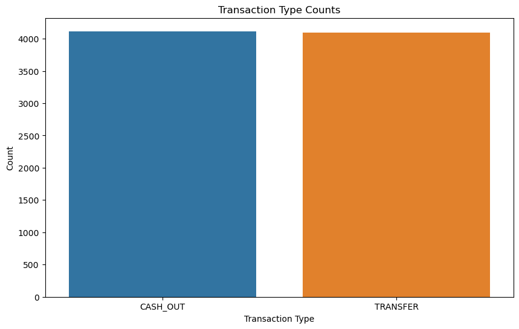
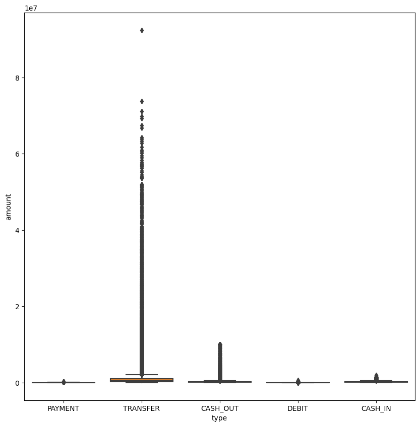
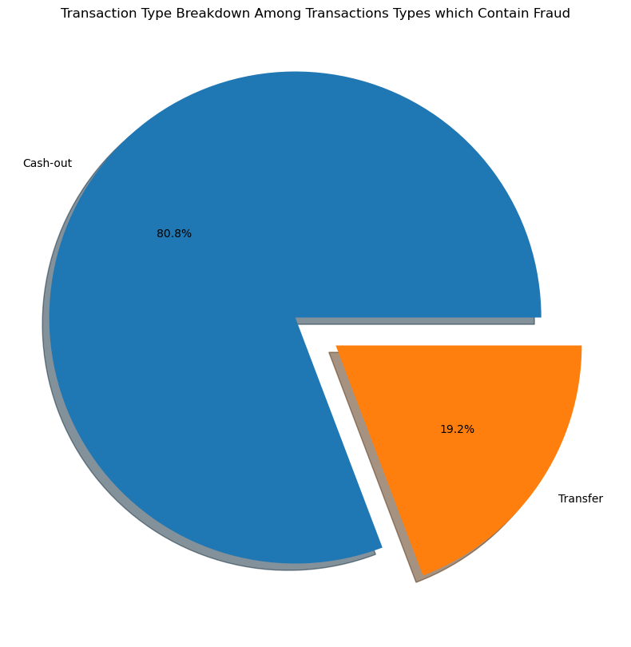
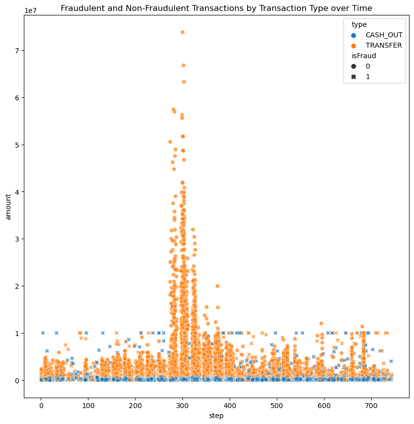
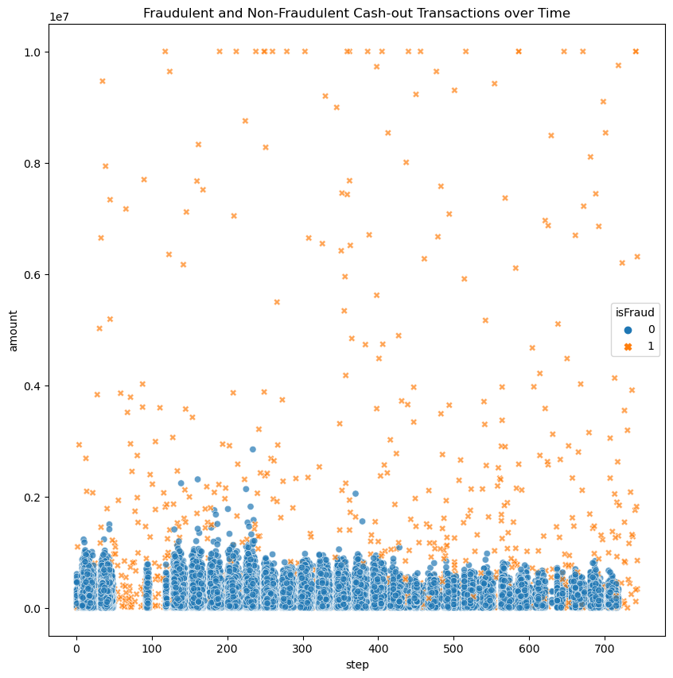
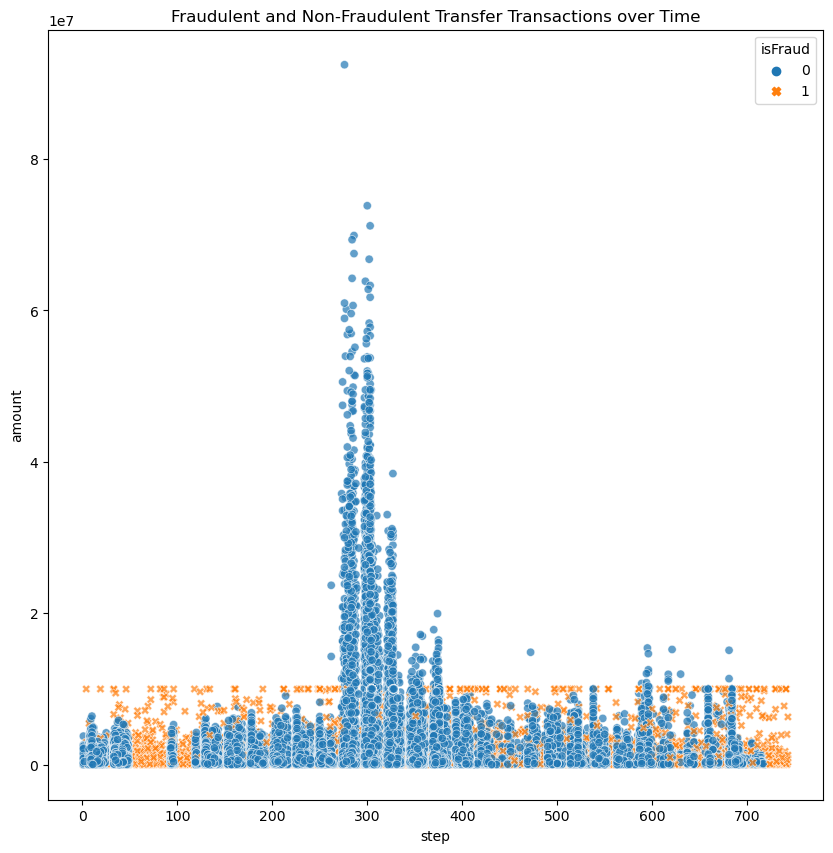
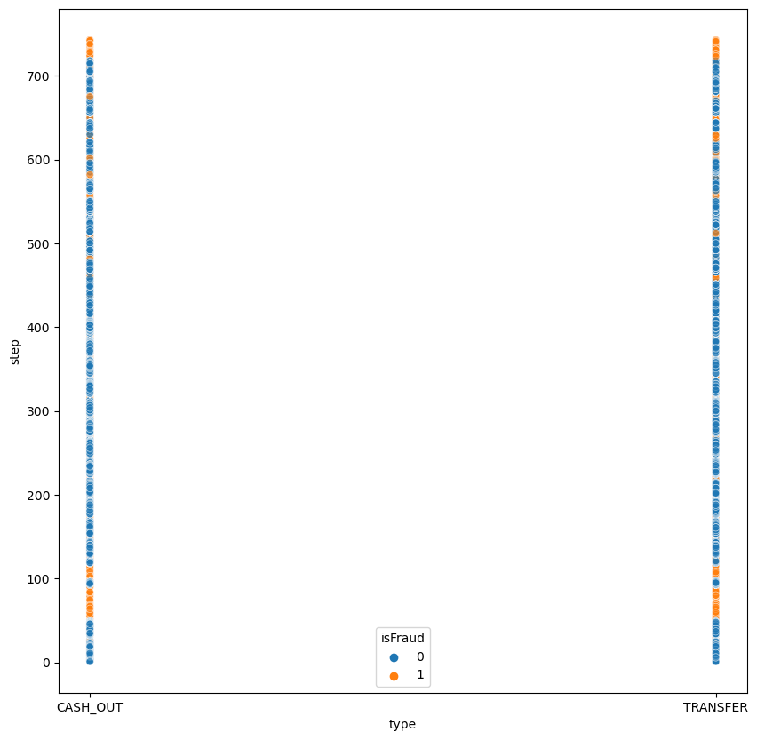
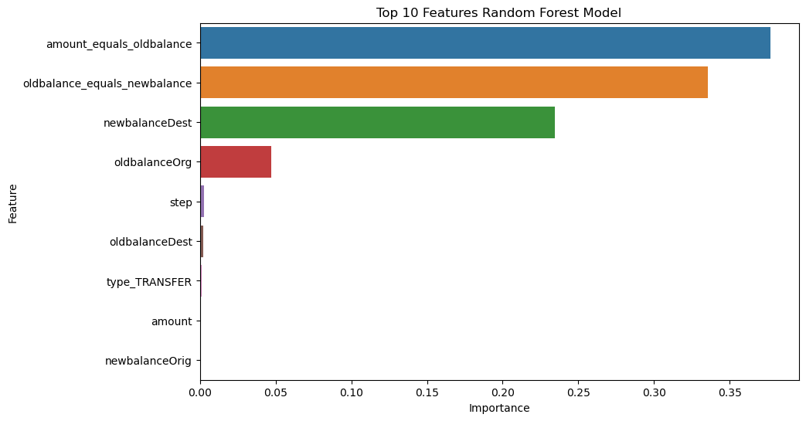

# Financial-Fraud
# Random Forest Model on Fraud Detection

## Project Overview

This project delves into transaction data. It was particularly challenging due to the amount of rows in the dataset (6362620)


## Dataset Overview

Dataset provided (`../data/raw/PS_20174392719_1491204439457_log.csv`)

## Columns

- Step: A unit of time that represents hours in the dataset. Think of this as the timestamp
of the transaction (e.g. hour 1, hour 2, ... hour 534, ...)
- Type: The type of transaction
- Amount: The amount of money transferred
- NameOrig: The origin account name

- OldBalanceOrg: The origin accounts balance before the transaction
- NewBalanceOrg: The origin accounts balance after the transaction
- NameDest: The destination account name
- OldbalanceDest: The destination accounts balance before the transaction
- NewbalanceDest: The destination accounts balance after the transaction
- IsFlaggedFraud: A “naive” model that simply flags a transaction as fraudulent if it is
greater than 200,000 (note that this currency is not USD)
- IsFraud: Was this simulated transaction actually fraudulent? In this case, we consider
“fraud” to be a malicious transaction that aimed to transfer funds out of a victim’s bank
account before the account owner could secure their information.

## Target Attribute

isFraud is the target attribute

## Goal
Train a model to predict on isFraud

## Project Workflow

### Part 1: Exploratory Data Analysis
#### Load data

```python
import pandas as pd
import numpy as np
import matplotlib.pyplot as plt
import seaborn as sns

df = pd.read_csv('../data/raw/PS_20174392719_1491204439457_log.csv')
```
#### Visualizing data



A breakdown of the proportions of transactions by Type



Visualizing the amount of transactions labeled as fraud

##### Since there are very few transactions that are marked as fraud I decided that from this point onward in the EDA, I would focus my attention on discovering patterns within transactions that were labeled as fraud.

#### Fraudulent Transactions

```python
df['isFraud'].value_counts()

isFraud
0    6354407
1       8213
```

Out of the 6.3 million rows, only 8213 of them were marked as fraud



Only CASH_OUT and TRANSFER transactions contained transactions that were labeled as fraud.



I should've log transformed this data to avoid this awkward visualization. However, the point is still clear; TRANSFER and CASH_OUT transactions also contain the majority of outliers among the types of transactions.

##### I created a dataframe that contained only TRANSFER and CASH_OUT transactions. I then created a random sample of 50,000 transactions to continue my EDA. 


Breakdown of transaction types among dataframe that contains fraudulent transactions.



This visualization depicts fraudulent and non-fraudulent transactions (x for fraud, o for not fraud), colored by transaction type, over time.



I created two charts that seperated the two transaction types

#### Discovery!

I uncovered a two unique pattern that occured across transactions when the amount was 10,000,000. A relationship existed when 'oldbalanceDest' and 'newbalanceDest' were equal to one another among TRANFER transactions that were equal to 10,000,000. 

I found another pattern among transactions with the amount 10,000,000 for CASH_OUT transactions. This pattern being 'amount' is equal to 'oldbalanceOrg'

I then decided to check if these patterns existed for the respective transactions regardless of the amount being 10,000,000. And they did!

Among transfer transactions, when 'oldbalanceDest' is equal to 'newBalanceDest', there are 4068 fraudulent transactions. The total fraud count in transfer transactions is 4097. Meaning that this relationship captures 99.3% (misses 29 other fraudulent transactions) of the fraudulent transfer transactions.

Among cash-out transactions, when 'amount' is equal to 'oldbalanceOrg', there are ONLY fraudulent transactions (4091). The total fraud count in cash-out transactions is 4116. Meaning that this relationship captures 99.4% (misses 25 other fraudulent transactions) of the fraudulent cash-out transactions.

These two patterns had a near perfect correlation to whether a transaction was labeled as fraud. (*unfortunately I did not incorporate visuals for this process)

I decided to engineer these columns in Part 2.


Appears to be a slight pattern emerging across time. For both CASH_OUT and TRANSFER types, there is are many fraudulent transactions occuring between the interval ~50 - 110 and + 720.


### Part 2: Data Transformation
Reduced the dataframe to only TRANSFER and CASH_OUT types
1. I figured it would add noise to the model if it were training on labeling fraud from transaction types from which fraud did not exist
2. I needed to reduce the amount of rows in the dataframe


Deleted columns I found to be erroneous. Namely:
```python ['nameOrig', 'nameDest', 'isFlaggedFraud'] ```
*I was considering dropping step however there was a small pattern that emerged at the end of my EDA

Feature engineering
```python 
new_df['amount_equals_oldbalance'] = (new_df['amount'] == new_df['oldbalanceOrg']).astype(int)

new_df['oldbalance_equals_newbalance'] = (new_df['oldbalanceDest'] == new_df['newbalanceDest']).astype(int)
```

Scaled, one hot encoded and saved for modeling


### Part 3: Build Model

Unfortunately the dataset was too large for my machine to handle. I attempted random samples of varying size, however I decided on quite a small sample size in the end. I would like to return and try this in an environment in which I could run across the entire dataframe

#### Build 
- Scale data
- Split
- Model


## Conclusion and Further Steps


### Insights
These images depict the top 10 features with highest importance in the model. Indicating that these features are most responsible for prediciting. It appears that my engineered features were the most important.




### Challenges

- How to deal with outliers
- Quantity of data

### Further steps

- When I reached part 2 I contemplated running two seperate models. I wanted to run one on a dataframe with only TRANSFER transaction types with it's unique pattern, and another with only CASH_OUT transactions and its respective engineered feature.
- I think doing this would improve the model performance tremendously
- If models such as this were developed and deployed, it require the data to be filtered by type. Each transaction type would require its own model, making for a more robust fraud detection system.
- however DEBIT, CASH_IN and PAYMENT transactions do not have data labeled as fraud, so more data would be required to build those models.
